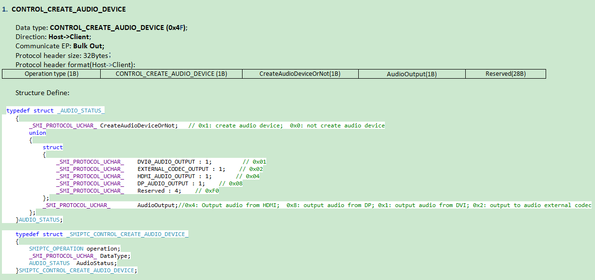
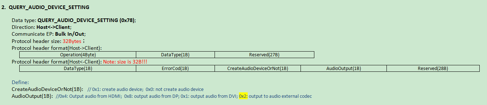

[TOC]
#业务记录
***
##1. Feature

###1.1 Driverless audio enable or disable according to APP 
_2019-4-12_

**description:**
for this requirement in Driver-less Project, we need fw support following two commands, I have modified the protocol for Create Audio Device and Query Audio Settings, attached is new protocol.
（关键词：Driver-less Project，commands，protocol）
根据要求，在`smiconsumer.c`中的`Commander`函数中根据协议新增的两条命令分别实现以下功能：
0.audio_status，
1.创建audio设备，
2. 



HDMI plug_in:host send `"enable audio"` cmd to fw,the fw will reset itselt and report both general and audio device.

**协议版本(smiprotocol.h)：**
>#define SMI_PROTOCOL_VERSION_NUM ("3.01")//new,1029lines
>#define SMI_PROTOCOL_VERSION_NUM ("2.20")//local,1446lines

**SMIPTC_DATA_TYPE(smiprotocol.h)：**
>CONTROL_CREATE_AUDIO_DEVICE = 0x4f
>QUERY_AUDIO_DEVICE_SETTING = 0x78

**结构体定义**
```c
typedef struct _AUDIO_STATUS_
{
    _SMI_PROTOCOL_UCHAR_ CreateAudioDeviceOrNot;   // 0x1: create audio device;  0x0: not create audio device
    union
    {
        struct
        {
            _SMI_PROTOCOL_UCHAR_    DVI0_AUDIO_OUTPUT : 1;         // 0x01
            _SMI_PROTOCOL_UCHAR_    EXTERNAL_CODEC_OUTPUT : 1;    // 0x02
            _SMI_PROTOCOL_UCHAR_    HDMI_AUDIO_OUTPUT : 1;       // 0x04
            _SMI_PROTOCOL_UCHAR_    DP_AUDIO_OUTPUT : 1;    // 0x08
            _SMI_PROTOCOL_UCHAR_    Reserved : 4;    // 0xF0
        };
        //0x4: Output audio from HDMI;  0x8: output audio from DP; 0x1: output audio from DVI; 0x2: output to audio external codec
        _SMI_PROTOCOL_UCHAR_        AudioOutput;
    };
}AUDIO_STATUS

typedef struct _SMIPTC_CONTROL_CREATE_AUDIO_DEVICE_
{
    SMIPTC_OPERATION operation;
    _SMI_PROTOCOL_UCHAR_ DataType;
    AUDIO_STATUS  AudioStatus;
}SMIPTC_CONTROL_CREATE_AUDIO_DEVICE;
```


new ocde:`smiconsumer.h`line 2956


##2. Bug
###2.1  On mac platform, do HDMI/CRT PnP, wait more than 3 minutes, the view can be disappear or create.

描述：when HDMI(mode:4k)play video and use smi-audio,the task of monitor-pnp will be hang.when pause or slow playing that task will going.
we think that monitor-pnp is 
How to handle this bug?
```c
/* Start SMI decode */->
SmiHardDecode((void *)InputStreamAddr, InputStreamLength, &dest, ViewIndex);->
SM768_YUVBlit_4KPMode((ul32)InputStreamAddr, view->ovlSrcAddr_YUV.bufYAddr);->
sb_IRQVectSet(SB_IRQ_VAL_DMA, Dma_Isr1),sb_IRQVectSet(SB_IRQ_VAL_DMA, Dma_Isr);->
sb_OS_LSR_INVOKE(DMA1CarryDone_LSR, 0),sb_OS_LSR_INVOKE(DMA1DecodeDone_LSR, 0);->
//计算DMA1DecodeDone_LSR与DMA1CarryDone_LSR执行时间，

//LSR时间测试：
extern unsigned long time_start,time_end;

if(time_start==1){
    audio_lsr_start=timerGetCounter(TIMER_1);
}

if(time_start==1&&time_end==0){
    audio_lsr_end=timerGetCounter(TIMER_1);
    audio_t_sum+=audio_lsr_start-audio_lsr_end;
    if(lsr_i<=20){
        plsr_timer[lsr_i]=(audio_lsr_start-audio_lsr_end);
        lsr_i++;
    }
}

/*LSR运行时间测试结构体*/
typedef struct LSR_time{
    unsigned long lsr_start; 
    unsigned long lsr_end;
    //结构体类型的静态成员变量的初始化问题
    static unsigned long lsr_sum_time;
    static unsigned long lsr_i;
    static unsigned long lsr_list_time[20];
}LSR_time={0,0,0,0},{0};

EDID测试：
MonitorPNP_Task = smx_TaskCreate((FUN_PTR)MonitorPNP, PRI_LOWER, PNP_STACK_SIZE, SMX_FL_NONE, "PNP");
edidRet = Get_EDID_Data(edidbuf, MONITOR_CRT1);
edidRet = readEDIDandUpdateModeList(EDID_SIZE, targetID);
ret =  SM768_detectEdidExSwI2C(
        gHDMIContext.pEdidBuffer,
        edidBufferSize,
        0,
        DEFAULT_I2CS_SCL,
        DEFAULT_I2CS_SDA);
swI2CReadReg_Continuous(EDID_DEVICE_I2C_ADDRESS, 0,TOTAL_EDID_REGISTERS_128,edidBuffer);
swI2CStart();
swI2CSCL(1);//ul retry_scl = 100000;
```


***
###2.2 程序跑飞？

>R6寄存器地址越界
>>

2.2.1 程序结束点：
>jmm.c  #reset后？？
```c
static avl_node_t*
avltree_insert(
    avl_node_t* tree,
    vmem_key_t key,
    page_t* page
    )
{
    if (tree == NULL) {
        tree = make_avl_node(key, page);
    } else {
        if (key >= tree->key) {
            tree->right = avltree_insert(tree->right, key, page); //lemon_复位停留处
        } else {
            tree->left  = avltree_insert(tree->left, key, page);
        }
    }
    tree = do_balance(tree);
    tree->height = MAX(HEIGHT(tree->left), HEIGHT(tree->right)) + 1;
    return tree;
}


```
###2.3 VW shutdown not show logo(and not run USB_Disconnect_LSR):
  *描述： ①关机不显示logo(显示关机前画面'01')；②(关开机不拔usb)开机重新显示logo；③host枚举到device并setID，fw依然显示logo。*
  *复现：①...②...③host枚举不到device，设备处于not_connect状态（usb已物理连接）*
 __①__ void USB_Disconnect_LSR(uint iParameter): [smicusor.c]//___shutdown(not restart)未进入usb_lsr，Nomal_pnp is ok.___

```c
//中断处理
int dwc_usb3_handle_dev_intr(dwc_usb3_pcd_t *pcd, u32 event):[pcd_intr.c]
case DWC_DEVT_DISCONN: //(未执行)enum-devt_data,Device Specific events (DEVT)(hw.h)
    dwc_debug0(pcd->usb3_dev, "Disconnect\n");
    ret = handle_disconnect_intr(pcd);
    sb_OS_LSR_INVOKE(USB_Disconnect_LSR, 0);
break;  

// 拔下usb处理逻辑：
usb_pnp->reset：show_logo<-appl_init<-ainit<-smx_go(xgo.h)<-main(main.c)
/* Create smx_Idle with ainit() as its initial code */
smx_Idle = smx_TaskCreate(ainit, PRI_SYS, smx_cf.stk_sz_idle, SMX_FL_LOCK, "smx_Idle");
if (!smx_Idle)
    smx_ERROR_SS(SMXE_SMX_INIT_FAIL, SMX_ERRH_SMX);
```
 __②__ 按下电源开关(5s~8s)usb检测到DWC_DEVT_DISCONN，执行USB_Disconnect_LSR，reset_device后执行正常操作，usb虽与host物理连接，但逻辑上处于Disconnect状态
 __③__ host枚举不到设备，重启 vw_service 查看log，没有设备检测到设备，smidecoder_task(处理host发来的ID_frame)未进入.
>**other_point:**
>> __video_wall__：__drive+fw__(path and version)+panel(license)+MPTool(CT+path)
设备管理器:main opt about vw_host_driver and  __service__
服务器 __path__：`ftp(\\\172.17.9.78\Graphics\Products...)+svn(svn://172.17.9.90) ` 
###2.4 Audio volume can't be adjusted when record.
>涉及知识点(原理与实现)：usbd_audio_record,iis_dma_isr_lsr,

>*描述：在Windows和Mac上录音的时候，调节音量的大小，但是录下的音频数据不变*
*复现：(电源操作不当(5V->12V)，致使两块电路板过压供电而出现故障(4.28已处理))*

业务代码|逻辑|原理|
-|-|-|-
`RB_Get_Record，RB_Put_Resample_Mono(smiQ.c)`|录音处理||
`SRAM_DMA_LSR(smiq.c)`|`iis_dma_isr_lsr`|
`SMI_AUDIO_PRIVATE_T(smiaudio.h/c _sys/smx/susbd/func_)`|数据结构体,数据更新函数|行为-参数匹配|
`SMI_AUDIO_MIC_VOL(audio.h _sys/smx/susbd/inc_)`|宏 `default mic volume`||

1.行为-参数是否匹配：host音量滑块-`iMicVolCur，`
2.参数如何调节录音：`main_func:RB_Get_Record，RB_Put_Resample_Mono`

```c
RB_Get_Record(&audio_rb_rcd_temp, (char *) resample, SMI_SUPPORTED_AUDIO_FORMAT_SRAM_INPUT_SECTION_SIZE/2);
RB_Put_Resample_Mono(&audio_rb_rcd, (char *)resample, SMI_SUPPORTED_AUDIO_FORMAT_SRAM_INPUT_SECTION_SIZE/2, g_SMI_SUPPORTED_AUDIO_FORMAT_SAMPLE_RATE, g_AUDIO_SAMPLE_RATE);
```
#Markdown笔记
https://blog.csdn.net/u014061630/article/details/81359144